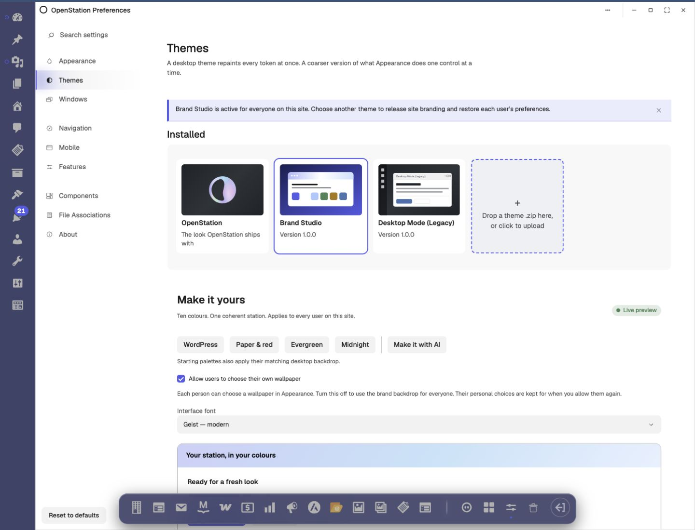
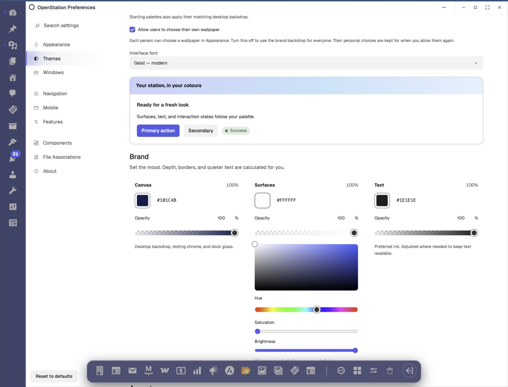
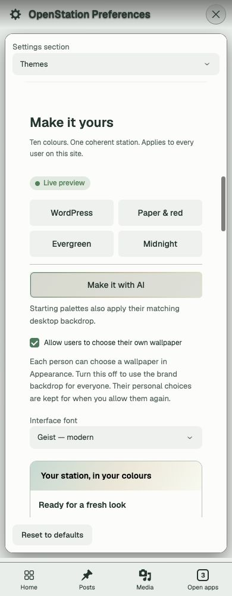

# Brand Studio screenshots

Captured from the running OpenStation Preferences window. Presets were applied for these captures and the original site branding was restored afterward.

## Desktop — WordPress preset

The theme library, preset controls, site-wide branding notice, personal-wallpaper permission and font selector.

## Colour picker

The WordPress preset with its white Surfaces swatch expanded. The rounded frame remains visible against the matching white panel; hex, opacity and HSV controls are available inline.

## Mobile — Evergreen preset

The responsive preset layout, separated AI entry, wallpaper permission and typography control at a 390-pixel viewport.

